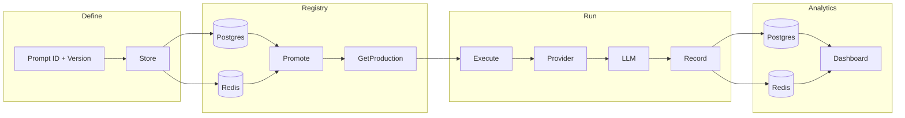

# loom

Production-ready Go library for managing, testing, optimizing, and versioning prompts for Large Language Models (LLMs). Type-safe, performant, and provider-agnostic.

## Why loom?

- **Production-first**: Versioning, promotion (dev → staging → production), rollback, and A/B testing
- **Type-safe**: Variables and validation at compile time; catch errors before deployment
- **Provider-agnostic**: OpenAI, Anthropic, Google, Cohere, local (Ollama) via a single interface
- **Observable**: Logging, metrics, caching, rate limiting, and circuit breaker middleware
- **Pure Go**: No Python dependency; integrate directly into your services

## Quick start (5 minutes)

```go
package main

import (
    "context"
    "github.com/klejdi94/loom"
)

func main() {
    engine := loom.DefaultEngine()
    prompt := loom.New("sentiment-analyzer").
        WithSystem("You are an expert sentiment analyzer.").
        WithTemplate("Analyze the sentiment of: {{.text}}").
        WithVariable("text", loom.String(loom.Required())).
        Build(engine)

    result, _ := prompt.Render(context.Background(), loom.Input{
        "text": "This product is amazing!",
    })
    // result.System, result.User
}
```

## Core concepts

- **Prompt**: Versioned template with system message, user template, variables, and few-shot examples.
- **Template**: Go `text/template` syntax with custom functions; variable interpolation and validation.
- **Registry**: In-memory, file-based, PostgreSQL, or Redis; versioning and promotion.
- **Provider**: OpenAI, Ollama, Anthropic, Google Gemini, Cerebras, Cohere; unified interface.
- **Executor**: Run a prompt against a provider with retry and timeout.
- **Evaluator**: Test suites and evaluators (exact match, contains, similarity/cosine, LLM judge, custom) for regression and quality.

## How it works

End-to-end flow from defining prompts to observing runs:



| Step | What happens |
|------|----------------|
| **Define** | Build a versioned prompt (ID, version, system, template, variables). |
| **Store** | Save to a **registry** (Postgres, Redis, file, or memory). |
| **Promote** | Mark a version as production (dev → staging → production). |
| **GetProduction** | Load the current production prompt from the registry. |
| **Execute** | Render the prompt, call a **provider** (OpenAI, Cerebras, etc.), get completion. |
| **Record** | Send run metrics (prompt_id, version, latency, tokens, success) to **analytics**. |
| **Analytics** | Persist in **Postgres** or **Redis**; query aggregates by prompt, version, or day. |
| **Dashboard** | HTTP UI that calls the analytics API and shows charts (runs over time, success by prompt/version). |

A longer flow design with the same diagram is in [docs/flow.md](docs/flow.md).

## Project structure

```
loom/
├── core/           # Prompt, Variable, Example, interfaces
├── template/       # Template rendering engine
├── registry/       # Memory, file, PostgreSQL, Redis, S3
├── provider/       # OpenAI, Ollama
├── executor/       # Execute with retry
├── evaluator/      # Test suites and evaluators
├── chain/          # Multi-step chains (parallel, retry, fallback, condition)
├── optimizer/      # A/B experiments (traffic split, winner promotion)
├── middleware/     # Logging, metrics, cache, rate limit, circuit breaker
├── cost/           # Token counting and cost estimation/tracking
├── cmd/loom/       # CLI for prompt management
└── examples/       # Runnable examples
```

## Installation

```bash
go get github.com/klejdi94/loom
```

## Usage

### Builder API

```go
prompt := loom.New("my-prompt").
    WithVersion("1.2.0").
    WithSystem("You are a helpful assistant.").
    WithTemplate("Answer: {{.question}}").
    WithVariable("question", loom.String(loom.Required())).
    WithExample(map[string]interface{}{"question": "What is 2+2?"}, "4").
    WithMetadata(map[string]interface{}{"domain": "math"}).
    Build(loom.DefaultEngine())
```

### Registry (memory, file, PostgreSQL, or Redis)

```go
// In-memory
reg := registry.NewMemoryRegistry()

// File-based (e.g. for CLI)
reg, _ := registry.NewFileRegistry("./.loom")

// PostgreSQL (go get github.com/lib/pq, import _ "github.com/lib/pq")
db, _ := sql.Open("postgres", dsn)
reg, _ := registry.NewPostgresRegistry(db, "prompts", true)

// Redis (go get github.com/redis/go-redis/v9) – distributed, same interface
rdb := redis.NewClient(&redis.Options{Addr: "localhost:6379"})
reg := registry.NewRedisRegistry(rdb, "loom:prompts")

reg.Store(ctx, prompt)
reg.Promote(ctx, "my-prompt", "1.2.0", registry.StageProduction)
prod, _ := reg.GetProduction(ctx, "my-prompt")
```

### Analytics with Postgres or Redis

Persistent run history so the analytics server (and dashboard) survive restarts:

```go
// PostgreSQL – same DB as registry or a dedicated DB
db, _ := sql.Open("postgres", analyticsDSN)
store, _ := analytics.NewPostgresStore(db, "prompt_runs")

// Redis – sorted set by timestamp
rdb := redis.NewClient(&redis.Options{Addr: "localhost:6379"})
store := analytics.NewRedisStore(rdb, "loom:analytics:runs")

// Record each run (e.g. from your app or executor middleware)
store.Record(ctx, analytics.RunRecord{
    PromptID: "summarizer", Version: "1.0.0", LatencyMs: 120, Success: true, ...
})
// Query aggregates (by prompt, version, or day)
agg, _ := store.Query(ctx, analytics.Query{GroupBy: "version", Limit: 20})
```

Run the analytics server with Postgres or Redis: `go run ./cmd/analytics-server -store=postgres -dsn=...` or `-store=redis -redis=localhost:6379`. Dashboard: `go run ./cmd/dashboard -api=http://localhost:8080`.

### Execute with OpenAI

```go
openai, _ := provider.NewOpenAI(provider.OpenAIConfig{APIKey: os.Getenv("OPENAI_API_KEY")})
exec := executor.New(openai, executor.WithRetry(3, executor.ExponentialBackoff(time.Second, 30*time.Second)))
result, err := exec.Execute(ctx, executor.ExecuteRequest{Prompt: prompt, Input: loom.Input{"question": "What is 2+2?"}})
// result.Content, result.Usage
```

### Test suite

```go
suite := evaluator.NewTestSuite("my-tests").
    WithPrompt(prompt, "v1.0.0").
    AddCase("simple", map[string]interface{}{"question": "Hi"}, evaluator.Expected{Output: "..."}).
    WithEvaluator(evaluator.ExactMatch{})
report, _ := suite.Run(ctx)
```

### Chains (sequential and parallel)

```go
exec := executor.New(openai)
ch := chain.NewChain("support-flow").
    WithExecutor(exec).
    Step("classify", classifyPrompt).
    Parallel(
        chain.ChainStep("extract", extractPrompt),
        chain.ChainStep("sentiment", sentimentPrompt),
    ).
    Step("reply", replyPrompt, chain.WithRetry(3, chain.ExponentialBackoff(time.Second, 30*time.Second)), chain.WithTimeout(30*time.Second))
result, _ := ch.Execute(ctx, input)
// result.Get("classify"), result.Get("sentiment"), result.Get("reply")
```

### Middleware (logging, metrics, cache, rate limit, circuit breaker)

```go
mw, counters := middleware.Metrics()
p := middleware.Chain(openai,
    middleware.Logging(log.Printf),
    mw,
    middleware.CacheMiddleware(middleware.NewInMemoryCache(), time.Hour),
    middleware.RateLimit(100, time.Minute),
    middleware.CircuitBreaker(0.5, 30*time.Second),
)
// use p as provider; counters.Requests(), counters.PromptTokens(), etc.
```

### A/B experiments

```go
exp := optimizer.NewExperiment("pricing-copy").
    Variant("control", controlPrompt, 0.5).
    Variant("personalized", personalizedPrompt, 0.5).
    WithMinSampleSize(1000).
    WithConfidenceLevel(0.95)
rendered, variant, _ := exp.Execute(ctx, input)
// ... call LLM, measure outcome ...
exp.RecordSuccess(ctx, variant, success)
if exp.HasWinner() {
    name, _ := exp.GetWinner()
    winnerPrompt := exp.Promote(name)
    // promote winnerPrompt to production in registry
}
```

### Cost estimation and tracking

```go
est := cost.NewEstimator("gpt-4", 0.03, 0.06) // $/1K tokens
inCost, outCost, total := est.Estimate(ctx, rendered, 500)

tracker := cost.NewTracker()
tracker.RegisterModel("gpt-4", 0.03, 0.06)
tracker.Record("gpt-4", result.Usage)
// tracker.TotalCostUSD(), tracker.TotalInputTokens()
```

### CLI

```bash
go build -o loom ./cmd/loom
./loom -registry .loom list
./loom get my-prompt
./loom promote my-prompt 1.2.0 production
echo '{"id":"p1","version":"1.0.0","template":"Hi {{.name}}"}' | ./loom store
```

## Examples

- `examples/basic` – Build and render a prompt
- `examples/registry` – Store and retrieve with in-memory registry
- `examples/evaluate` – Run a test suite
- `examples/realworld-cerebras` – **Full 360**: Postgres registry, versioned prompts, promote, Cerebras, analytics, dashboard (see [examples/realworld-cerebras/README.md](examples/realworld-cerebras/README.md); requires `docker compose up` for Postgres + analytics)

Run an example:

```bash
cd loom/examples/basic && go run .
# Full flow with Postgres + analytics (start Postgres first: docker compose up -d)
cd examples/realworld-cerebras && go run .
```

## Requirements

- Go 1.21+
- For OpenAI: set `OPENAI_API_KEY` when using the OpenAI provider

## Phase 3 (advanced)

- **Redis registry**: `registry.NewRedisRegistry(redisClient, "prefix")` – distributed storage (go get github.com/redis/go-redis/v9).
- **LLM-as-judge**: `evaluator.LLMJudge{Provider: openai, Model: "gpt-4o-mini", Criteria: "..."}` – use an LLM to score actual vs expected.
- **Analytics**: `analytics.NewMemoryStore(max)` (in-memory), `analytics.NewPostgresStore(db, table)` or `analytics.NewRedisStore(redisClient, key)` for persistent history; record runs and query aggregates (by prompt, version, day).
- **S3 registry**: `registry.NewS3Registry(store, "prefix")` with `registry.BlobStore`; use `registry/s3blob` for AWS S3 (go get github.com/aws/aws-sdk-go-v2/config, service/s3).
- **Auto-promotion**: `experiment.WithOnWinner(func(name string, p *core.Prompt) { reg.Promote(ctx, p.ID, p.Version, registry.StageProduction) })` – when a winner is detected, promote in one place.

## Phase 4 (analytics API & Kubernetes)

- **Analytics HTTP server**: `analytics.NewServer(store, ":8080")` – `POST /record`, `GET /aggregates`, `GET /health`. Run with `go run ./cmd/analytics-server` (optional `-addr`, `-store=memory|postgres|redis`, `-dsn`, `-redis`). **Dashboard**: `go run ./cmd/dashboard` (optional `-addr=:8081`, `-api=http://localhost:8080`) – HTML/JS UI with charts (runs over time, success rate by prompt).
- **Kubernetes operator**: Prompt CRD (`deploy/prompt-crd.yaml`) and controller that syncs Prompt CRs into a registry. Build and run `./cmd/prompt-operator`. See `docs/k8s.md`.

## Roadmap

- **Phases 1–4 (done)**: Core, template, registries (memory, file, PostgreSQL, Redis, S3), OpenAI + Ollama + Anthropic + Gemini + Cerebras + Cohere, executor, evaluator (exact, contains, similarity, LLM judge), chains, middleware, A/B + auto-promotion, cost tracking, CLI, analytics (memory/Postgres/Redis), analytics HTTP API, dashboard UI, Kubernetes CRD + operator
- **Future**: More embedding providers for similarity evaluator

## License

Open source – use your preferred license (MIT recommended).

## Contributing

Contributions welcome: issues, docs, and PRs. Please run tests and `golangci-lint` before submitting.
