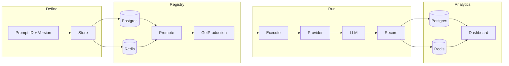

# How loom works – flow design

End-to-end flow from defining prompts to observing runs in the dashboard.

## Diagram

## Steps

| Step | What happens |
|------|----------------|
| **Define** | Build a versioned prompt (ID, version, system, template, variables). |
| **Store** | Save to a **registry**: Postgres, Redis, file, or memory. |
| **Promote** | Mark a version as production (dev → staging → production). |
| **GetProduction** | Load the current production prompt from the registry. |
| **Execute** | Render the prompt, call a **provider** (OpenAI, Cerebras, etc.), get completion. |
| **Record** | Send run metrics (prompt_id, version, latency, tokens, success) to **analytics**. |
| **Analytics** | Persist in **Postgres** or **Redis**; query aggregates by prompt, version, or day. |
| **Dashboard** | HTTP UI that calls the analytics API and shows charts (runs over time, success by prompt/version). |

## Registry and analytics backends

- **Registry**: Store and retrieve prompts. Use **Postgres** for a single source of truth or **Redis** for distributed, low-latency access. Same interface: `Store`, `Get`, `GetProduction`, `Promote`, `ListVersions`.
- **Analytics**: Store run records. Use **Postgres** for SQL queries and durability, or **Redis** for high write throughput. Same interface: `Record`, `Query` (aggregates by prompt, version, day, hour).

## Full example

See [examples/realworld-cerebras/README.md](../examples/realworld-cerebras/README.md): Postgres registry, two versioned prompts, promote, execute with Cerebras, record to analytics, view on dashboard.
